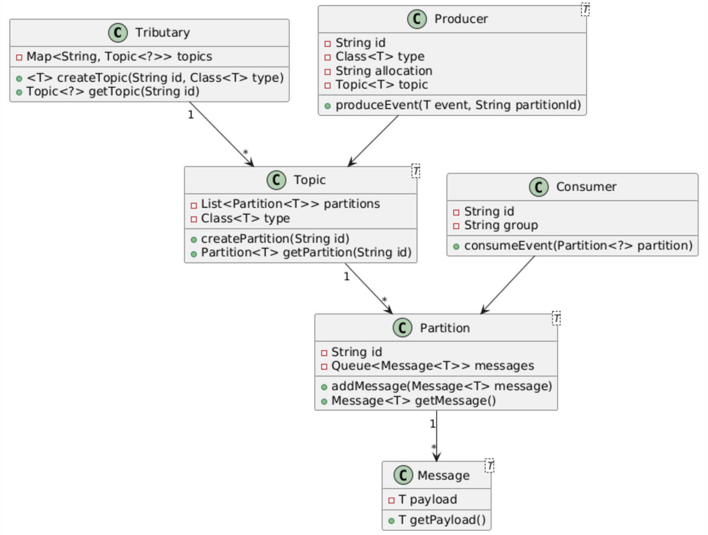

# Task 1
## An analysis of the engineering requirements:

We designed a event-driven architecture enables asynchronous communication between system components. This enhances scalability and decoupling. The system should organize events within a 'tributary cluster' containing topics, which are divided into partrs to work for parallel message processing. And there are messages, with headers (including datetime, ID, and payload type), keys, and values, are transmitted by producers to the system. We shall also be able to randomly assign or specify a partition key. Then Consumers, They will woirk individually or within consumer groups, process these messages from partitions, ensure each partition is managed by one consumer with each group. 
The system must support dynamic re-balancing of partitions among the consumers, so we must use strategies like range and round-robin, and allow consumers to replay messages from specific offsets to address failures or other needs. Some points to note is that We must ensure that the system handles multiple producers and consumers correctly. Also use Java generics to handle different types of event payloads. And also make an API for possible future developments

## A list of usability tests - a “checklist” of scenarios which someone testing your system via the command line interface could use to verify that your system works according to the requirements:

**Create Topic**\
**Command:** create topic user_profiles String\
**Expected Output:** Confirmation that the topic has been successfully created with type String.

**Create Partition**\
**Command:** create partition user_profiles partition_1\
**Expected Output:** Confirmation that the partition has been successfully created and associated with the topic user_profiles.

**Create Consumer Group**\
**Command:** create consumer group group_A user_profiles Range\
**Expected** Output: Confirmation that the consumer group has been successfully created with Range rebalancing strategy.

**Create Producer**\
**Command:** create producer producer_A String Manual\
**Expected Output:** Confirmation that the producer has been successfully created with Manual partition selection strategy.

**Produce Event**\
**Command:** produce event producer_A user_profiles {"id":1,"name":"Alice"}\
**Expected Output:** Confirmation that the message has been successfully sent to the specified partition.

**Consume Event**\
**Command:** consume event consumer_1 partition_1\
**Expected Output:** Confirmation that the consumer has successfully consumed the message, and display the message content.

**Show Topic**\
**Command:** show topic user_profiles\
**Expected Output:** Display the topic details including partitions and their messages.

**Show Consumer Group**\
**Command:** show consumer group group_A\
**Expected Output:** Display the details of the consumer group including consumers and their assigned partitions.

**Set Rebalancing Strategy**\
**Command:** set consumer group rebalancing group_A RoundRobin\
**Expected Output:** Confirmation that the rebalancing strategy has been successfully updated to RoundRobin.

**Replay Messages**\
**Command:** playback consumer_1 partition_1 0\
**Expected Output:** Display the messages from the specified offset.

## Your design for a Java API by which someone could use your solution to setup an event-driven system.

## A testing plan which explains how you are going to structure your tests for the system. You will need a mix of unit tests on individual components as well as integration tests to check that components work together. Your usability tests will need to be incorporated into this plan as well.
There are the tests:\
**Unit Tests:**\
**Tributary Class**\
Test creating and retrieving topics.\
Ensure topics are correctly stored in the map.

**Topic Class**\
Test creating and retrieving partitions.\
Ensure partitions are correctly stored in the list.

**Partition Class**\
Test adding and retrieving messages.\
Ensure messages are correctly stored and retrieved in FIFO order.

**Producer Class**\
Test producing events to specified partitions.\
Ensure messages are correctly added to partitions.

**Consumer Class**\
Test consuming events from partitions.\
Ensure messages are correctly consumed in order.

**Integration Tests:**

**End-to-End Message Flow**\
Create a topic with partitions, a producer and produce events to the partitions and a consumer group and consume events from the partitions. Then ensure the entire message flow works correctly.\
**Consumer Group Rebalancing**\
This is to test the rebalancing strategies. Check partitions are correctly rebalanced among consumers.\
**Message Replay**\
Replay messages from a specific offset. Test consumers can correctly replay and 'consume' messages.

*When it comes to implementation, there are two ways you can go about implementing a solution:*\
*We have chosen the ***Component-driven*** approach.*

# Task 2

**Create Topic:**
create topic user_profiles String

**Create Partition:**
create partition user_profiles partition_1

**Create Consumer Group:**
create consumer group group_A user_profiles Range

**Create Producer:**
create producer producer_A user_profiles String Manual

**Produce Event**
produce event producer_A user_profiles {"id":1,"name":"Alice"} partition_1

**Create Consumer**
create consumer group_A consumer_1

**Consume Event**
consume event consumer_1 user_profiles partition_1

**Show Topic**
show topic user_profiles

**Show Consumer Group**
show consumer group group_A

**Set Rebalancing Strategy**
set consumer group rebalancing group_A RoundRobin

**Replay Messages**
playback consumer_1 user_profiles partition_1 0

**The following is the video:**
[demostrate.mp4](demostrate.mp4)

# Task 3
## Your final testing plan and your final list of usability tests

Here are the testing plans:
First, we should use **unit tests** to ensure component of the system, namely Topic, Partition, Producer, Consumer, ConsumerGroup is tested individually one by one to ensure they function correctly individually. Then, **integration tests** are performed to check the interactions between different components, like between producing and consuming events, and rebalancing strategies. The overall testing structure remain the same as the initial plan as folowing the spec.

**Final Usability Tests:**
Create Topic:            Create a topic named user_profiles with a String type.\
Create Partition:        Create a partition named partition_1 in the user_profiles topic.\
Create Consumer Group:   Create a consumer group named group_A for the user_profiles topic with Range rebalancing strategy.\
Create Producer:         Create a producer named producer_A for the user_profiles topic with a String type and Manual allocation method.\
Produce Event:           Produce an event {"id":1,"name":"Alice"} to partition_1 in the user_profiles topic.\
Create Consumer:         Create a consumer named consumer_1 in the group_A consumer group.\
Consume Event:           Consume the event from partition_1 in the user_profiles topic using consumer_1.\
Show Topic:              Display the details of the user_profiles topic.\
Show Consumer Group:     Display the details of the group_A consumer group.\
Set Rebalancing Strategy: Set the rebalancing strategy for group_A to RoundRobin.\
Replay Messages:        Replay messages from offset 0 in partition_1 in the user_profiles topic using consumer_1.

## An overview of the Design Patterns used in your solution;
**Single Instance Pattern:** Used in the Tributary class to ensure that only one instance of system exists.\
**Factory Pattern:** Create instances of Producer, Consumer, ConsumerGroup, allow more flexible object creation.\
**Observer Pattern:** Implemented in the 'Consumer' and 'Producer' classes, notifying consumers whenever new events are produced.\
**Strategy Pattern:** Used in the rebalancing strategies for ConsumerGroup to allow dynamic changes to the rebalancing algorithm.

## Explanation of how you accommodated for the design considerations in your solution
We took note of **Concurrency** as mentioned in the spec, so we used synchronized methods so when multiple producers and consumers interact with shared entities such as topics and partitions, correctness is ensured. In terms of **Generics**, we decided to use Java Generics to allow topics and partitions to handle different types of event payloads, so that type safety is maintained.
Last, we designed the system while taking note of SOLID so that it is  easily extendable. In future developments we are able to add new types of producers, consumers, and rebalancing strategies easily.

## A brief reflection on the assignment, including on the challenges you faced and whether you changed your development approach.
it is hard, Initially, we need to understanding the requirements and the interactions between different components was challenging.
and do the test to acheive 80% and need to managing thread safety and ensuring that producers and consumers could interact with shared resources without conflicts required careful planning and implementation.
it is challenge for us. We learn alot in this assignment.

**Final UML diagram:**

